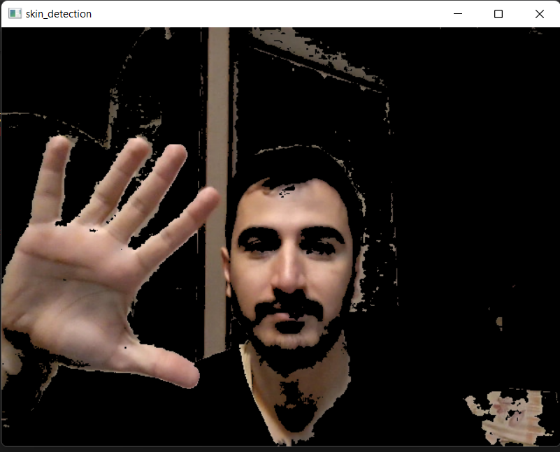

# Image_Processing_10

## Skin_detection:

La détection de la peau est le processus de recherche des pixels et des régions des couleur de peau dans une image ou un vidéo.

des bibliothèques utilisés :
- OpenCv, Numpy

des functions utilisés :

- cv2.cvtColor(), cv2.inRange(), cv2.bitwise_and()
---

---

## Superman:

Il s'agit de mettre le superman sur un background convenable.
ce programme a été créé par convertir des pixels RGB en HSV et les decouvrir dont 'S' value est plus de 50 et 'H' value est entre 35 et 75.

la sortie :

